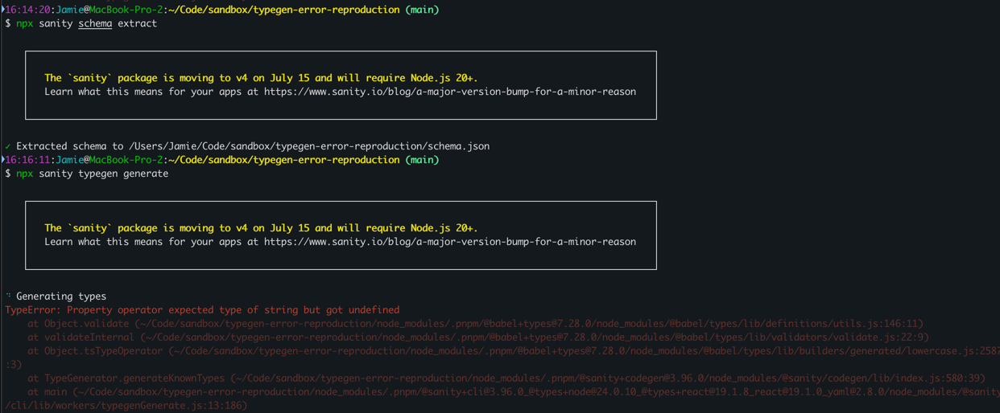

# typegen-error-reproduction

Reproduction of the typegen error from Sanity



To reproduce:

```
1. Clone repo

2. npx sanity schema extract

3. npx sanity typegen generate

4. Observe error
```

Expectation is types are correctly generated with no error.

See: https://github.com/sanity-io/sanity/issues/9870